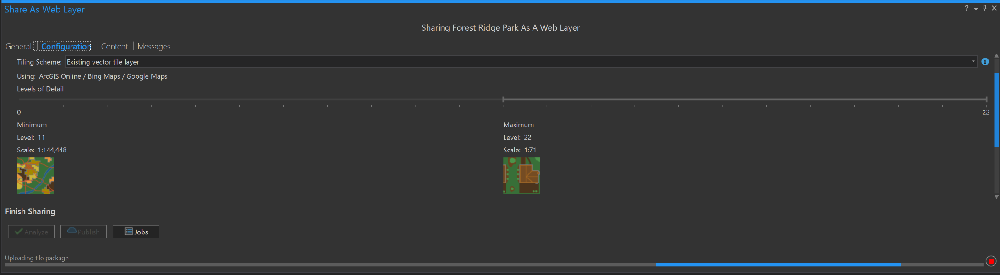

# Vector Map Tiling

## &lt;!-Bug: Map tiles not displaying properly on SOME mobile devices!-&gt;

Looks like the vector map tile published to AGOL works as expected on desktop browser. The same map/application on some mobile devices produces a black layer behind the vector tile features. This black layer covers the base map below.

### Fix \(No solution yet\):

This problem . Tried merging tile layer to base map, but black layer persists. There _may_ be a setting to change in the JSON, but likely limitations to rendering done on some mobile browsers?  Going to test with others 4/18/18.

## Why use map tiles?

Map tiles are a good way to publish layers that will only be used for reference and not be editable for online maps. A main benefit to map tiling from experience is the scalability of labels, which is limited for AGOL feature layers. In order to reconfigure your styles and labels after publishing, you may update it by manipulating the json file of your tile item: 

{% embed data="{\"url\":\"https://doc.arcgis.com/en/arcgis-online/create-maps/update-vector-tile-style.htm\",\"type\":\"link\",\"title\":\"Update vector tile layer style—ArcGIS Online Help \| ArcGIS\",\"description\":\"When you update the style for a hosted vector tile layer, the updated style is applied to the original vector tile layer.   However, the updated style shows as a new vector tile layer, and it has a different item ID than the original layer.\",\"icon\":{\"type\":\"icon\",\"url\":\"https://doc.arcgis.com/assets/img/favicon.ico\",\"aspectRatio\":0}}" %}

## Publishing map tiles from ArcGIS Pro

In order to publish map tiles and vector map tiles from ArcGIS Pro, you must first verify that you are a level 2 named user with tile publishing rights. You may check what kind of role you have in the "My Profile" section of your account. You may style and label how you would want your tile to look from an ArcGIS Pro map. Note that there may be some slight differences in what you style locally and the export you create online. An example if this would be some text appearing slightly larger when pushed online. Check out the guide below:



## Why can't my tiles be displayed? Or why can't I zoom in further?

When publishing your vector map tile, be mindful of its tiling scheme. When using ArcGIS Pro to publish tiles, the tiling scheme can be configured under the "Configuration' tab under "Caching".  Here you can see limits to scale. Some tiling schemes will only allow you to zoom in so far. There are a total of 23 levels of detail - leaving your tile scheme at the default will set your maximum level of detail to 19 \(around the neighborhood/building scale\). If you use the WGS84 scheme, you will be able to move the slider to higher level of detail, but your content will not be compatible with AGOL when trying to add the layer to a map. A work around for this is to select "Existing vector tile layer" for your tiling scheme, and when prompted, select an ESRI basemap. This way you will be able to cache at level 22 and your tile can be integrated seamlessly in AGOL. 



> The support link above describes the scenario and work around

## Generating a custom tile scheme

#### \* This can only be done with MXDs, may be best to work from ArcMap when dealing with custom tiling schemes



This guide will walk you through creating a custom tiling scheme. This is required when you require a higher level of detail in terms of zoom level. If your tiles fall outside of the tiling scheme, it will not show anything at that scale.

