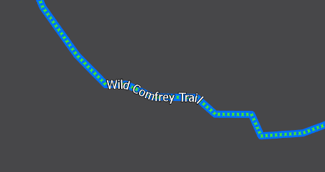

# Notes



Don't forget the \[https://\] when deploying to allow location tracking.

### Try vector tiles for features so that labels are dynamic\(er\) in AGOL

* May need to get Ryan to publish as I do not have the rights
* Got rights to publish
* Works great but consider the update process - tiles not streamed

### Symbology for trails

* Top line layer - Marker fill by surface type. Circles and/or X's?
  * Marker placement &gt; placement template controls distance between markers
* Bottom line layer - larger size based on blaze color, makes translucent? 
* If and when structures are added, we can adopt a marker and color type for it.

### Labels

* Pay attention to label scales
* White text, black 0.5 halo
* Include mileage for trail/main segment in label.
  * Generate with add geometry script

### Map tile creation

* Tiling Scheme should be set at WGS84 for greater LoD. Up to 22, 23 is max.
  * IN ORDER TO DO THIS - MUST REPROJECT ALL TO MATCH
* Tiling scheme can be created from rasters... for vectors it must be MXD?

